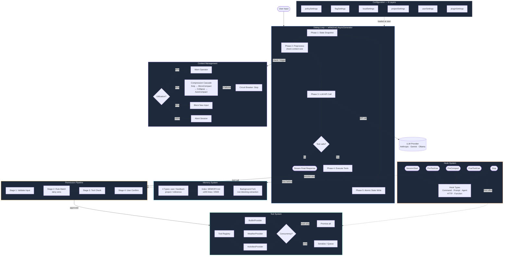
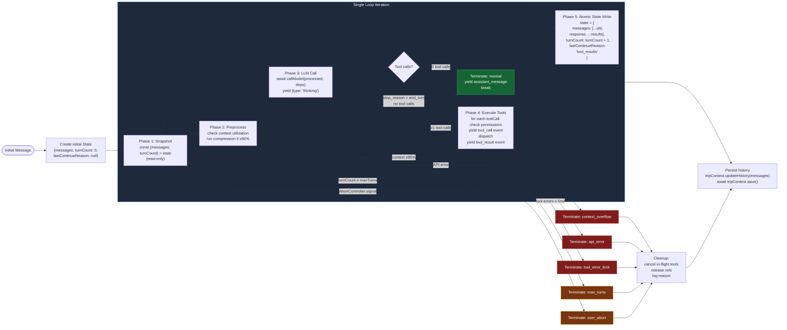
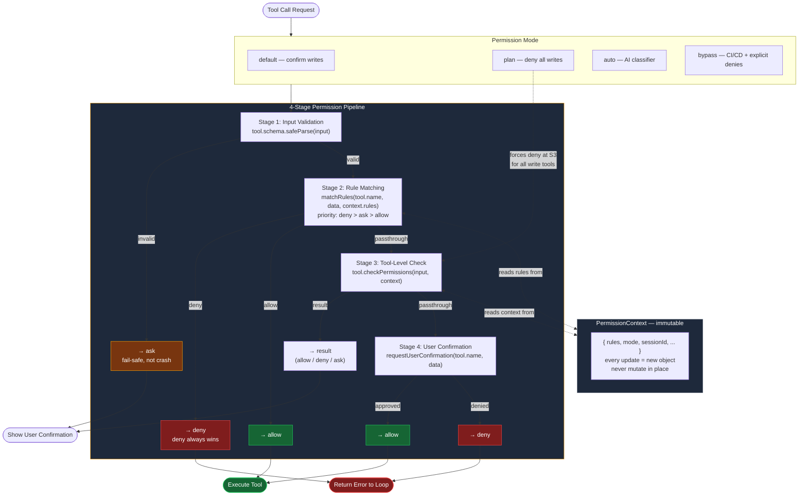
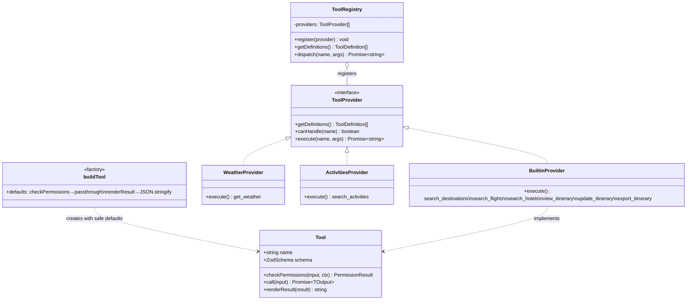
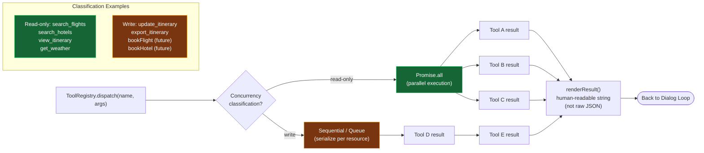
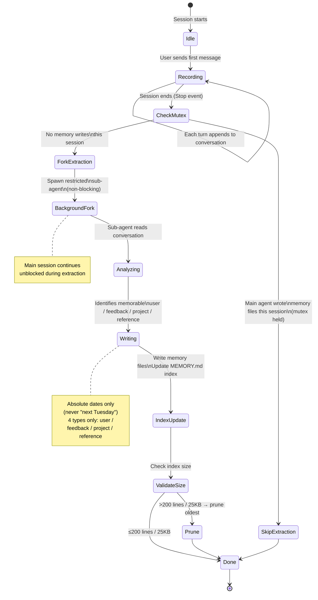
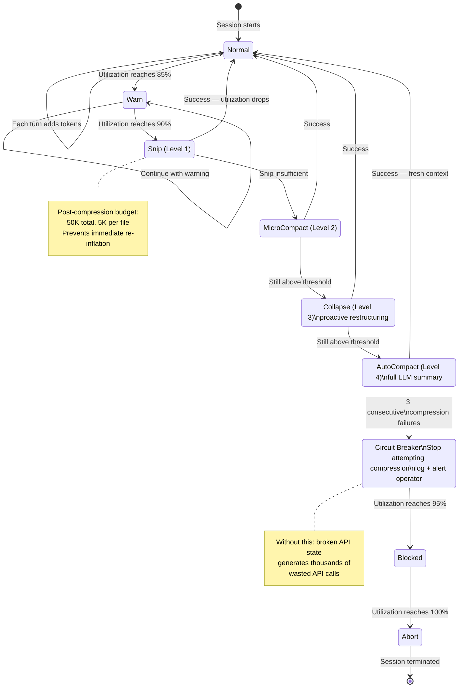
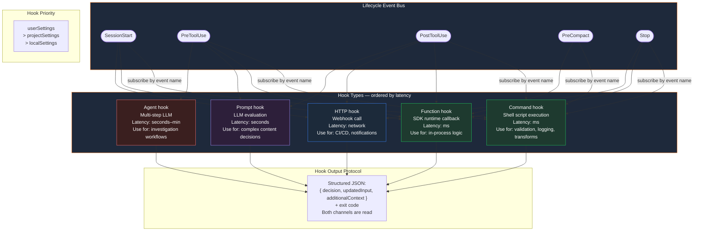
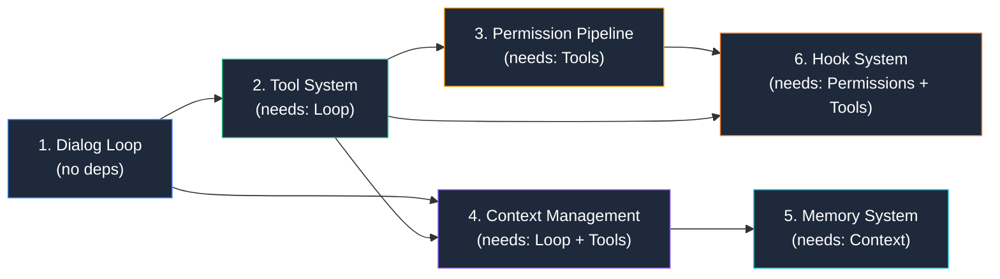

# Agent Harness — Architecture Diagrams

Six Mermaid diagrams covering the complete agent harness architecture. All diagrams render natively on GitHub, VS Code (with Mermaid Preview), and Notion.

---

## Diagram 1: System Architecture Overview

The full runtime data flow — all six components and how they interconnect when an agent is running. The dialog loop is the center; every other component either feeds into it or extends it.



> **SPEC.md reference:** § Component Dependency Order, § Component 1–7

---

## Diagram 2: Dialog Loop — Phase-by-Phase

The internal anatomy of the loop with all five phases and every termination path. State is read-only at the top and written atomically at the bottom — never mutated mid-iteration.



> **SPEC.md reference:** § Component 1: Dialog Loop

---

## Diagram 3: Permission Pipeline — 4-Stage Flow

Every tool call passes through four stages in order. Any stage can short-circuit. Deny always wins over allow regardless of stage. Stage 1 fails safe on bad input — routes to `ask`, never crashes.



> **SPEC.md reference:** § Component 3: Permission Pipeline

---

## Diagram 4: Tool System — Interface, Registry, Concurrency

The five-element tool contract, the factory pattern, the provider registry, and how read vs write tools are dispatched differently at execution time.





> **SPEC.md reference:** § Component 2: Tool System

---

## Diagram 5: Memory System + Context Compression Lifecycle

Two state machines that govern how the harness manages information over time: the memory extraction lifecycle (cross-session persistence) and the context compression cascade (single-session overflow handling).





> **SPEC.md reference:** § Component 5: Memory System, § Component 6: Context Management

---

## Diagram 6: Hook System + Multi-Agent Patterns

The hook system's lifecycle event bus and how the five hook types connect to it. Plus the two multi-agent coordination patterns (Fork and Coordinator) and where they fit in the harness.



```mermaid
flowchart TD
    subgraph Fork["Fork Pattern — Parallel Subtasks"]
        FC([Coordinator]) -->|"shared prefix\n+ scoped tools"| FA[Sub-Agent A\nExplore type]
        FC -->|"shared prefix\n+ scoped tools"| FB[Sub-Agent B\nExplore type]
        FC -->|"shared prefix\n+ scoped tools| FCC[Sub-Agent C\nPlan type]
        FA -->|"plain text result"| Merge[Coordinator merges results]
        FB -->|"plain text result"| Merge
        FCC -->|"plain text result"| Merge
        Merge --> FOut([Final response])
    end

    subgraph Coord["Coordinator Pattern — Enterprise Orchestration"]
        CC([Coordinator Agent\ndoes NOT execute tools]) -->|"delegates to"| CS1[Specialist A\nGeneral Purpose]
        CC -->|"delegates to"| CS2[Specialist B\nGeneral Purpose]
        CC -->|"delegates to"| CS3[Specialist C\nVerification]
        CS1 & CS2 & CS3 -->|"reports back"| CC
        CC --> COut([Synthesized output])
    end

    subgraph Depth["Depth Limit — enforced in code"]
        D1[Coordinator\nDepth 0] --> D2[Sub-Agent\nDepth 1]
        D2 --> D3[Sub-Sub-Agent\nDepth 2]
        D3 -. "depth ≥ 3\nHARD STOP" .-> D4[❌ Cannot spawn]
    end

    subgraph Types["4 Built-in Agent Types"]
        AT1["Explore\nread-only tools\ncheaper model\nno CLAUDE.md"]
        AT2["Plan\nread-only tools\nstructured output\narchitecture decisions"]
        AT3["General Purpose\nfull tool set\nimplementation tasks"]
        AT4["Verification\nno/read-only tools\nadversarial testing\nruns in background"]
    end

    style Fork fill:#1e293b,stroke:#3b82f6,color:#fff
    style Coord fill:#1e293b,stroke:#8b5cf6,color:#fff
    style Depth fill:#1e293b,stroke:#ef4444,color:#fff
    style D4 fill:#7f1d1d,stroke:#ef4444,color:#fff
    style AT1 fill:#1e3a2f,stroke:#22c55e,color:#fff
    style AT2 fill:#1c2a3a,stroke:#3b82f6,color:#fff
    style AT3 fill:#2d1f3a,stroke:#a78bfa,color:#fff
    style AT4 fill:#3a1f1f,stroke:#f87171,color:#fff
```

> **SPEC.md reference:** § Component 7: Hook System, § Component 8: Multi-Agent Patterns

---

## Quick Reference: Component Build Order

The dependency graph that determines which component to build first.



> **SPEC.md reference:** § Component Dependency Order
