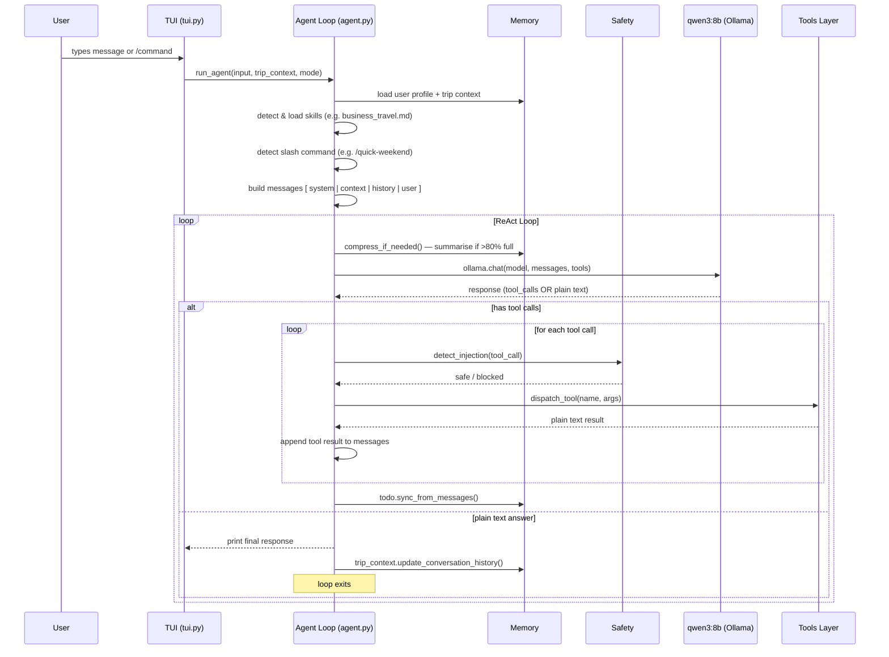

# claude-code-travel-agent

A travel planning agent that demonstrates all 10 design patterns from the [Claude Code Architecture Series](../_posts/2026-03-22-building-a-travel-agent-with-claude-code-patterns-bonus.md).

Runs locally on **qwen3:8b** via Ollama or any of the supported cloud LLMs. Searches and plans — does not book.

---

## How It Works

The agent is a single-threaded **ReAct loop** (Reason + Act). Every user message triggers one pass through the loop until the model produces a plain-text answer with no tool calls.



### Patterns in Action

| Pattern | Where It Lives | What It Does |
|---------|---------------|--------------|
| **P1 Master Loop** | `agent.py:run_agent()` | `while True` — drives every interaction |
| **P2 Uniform Tool Interface** | `tools/*.py` | Every tool: JSON in → plain text out |
| **P3 Memory by Time Scale** | `memory/` | TodoList (RAM) · TripContext (session) · UserProfile (disk) |
| **P4 Compress Before Truncate** | `memory/compressor.py` | LLM-summarises history when context hits 80% |
| **P5 Autonomy Dial** | `config.py MODES` + `/mode` | passive / default / proactive — injected into system prompt |
| **P6 Extension Mechanisms** | `skills/` · `commands/` | Skills = auto-context · Commands = macro templates |
| **P7 Cap Subagent Depth** | Architecture only (not yet wired) | Design for depth=1; add when dispatch is needed |
| **P8 Prefer Simple Infra** | `dummy_data/*.json` · `~/.travel-agent/` | JSON files, no DB, plain text everywhere |
| **P9 Explicit Plans** | `memory/todo.py` | TODO list updated after every tool round |
| **P10 Layered Safety** | `safety/injection_filter.py` | Regex injection scan before each tool call |

---

## Quick Start

### Prerequisites

- Python 3.11+
- [Poetry](https://python-poetry.org/docs/#installation)
- [just](https://github.com/casey/just) (task runner)

**Option A — local model (no API key needed):**
- [Ollama](https://ollama.com/) with `qwen3:8b` pulled

**Option B — cloud LLM:**
- Set `ANTHROPIC_API_KEY`, `OPENAI_API_KEY`, `GROQ_API_KEY`, or `GEMINI_API_KEY`

```bash
# 1. Install dependencies (Ollama provider only)
just install

# 2. Pull the default local model
just pull-model          # pulls qwen3:8b

# 3. Verify setup
just check

# 4. Run
just run
```

To run with a cloud LLM instead:

```bash
# Anthropic Claude
just install-anthropic
just run-claude          # uses claude-sonnet-4-5 by default

# OpenAI
just install-openai
just run-openai          # uses gpt-4o by default

# Groq (fast, free tier available)
just install-openai      # Groq uses the OpenAI SDK
just run-groq

# Google Gemini
just install-openai      # Gemini also uses the OpenAI SDK
just run-gemini
```

---

## Supported LLM Providers

The agent supports six LLM backends through a uniform `LLMClient` interface. You can swap providers without touching the agent loop.

| Provider | Just command | Env var | Notes |
|----------|-------------|---------|-------|
| **Ollama** | `just run-ollama` | — | Local, free, private. Default: `qwen3:8b` |
| **Anthropic** | `just run-claude` | `ANTHROPIC_API_KEY` | Best reasoning. Supports prompt caching. |
| **OpenAI** | `just run-openai` | `OPENAI_API_KEY` | Default: `gpt-4o` |
| **Groq** | `just run-groq` | `GROQ_API_KEY` | Very fast inference. Default: `llama-3.3-70b` |
| **Together AI** | `LLM_PROVIDER=together just run` | `TOGETHER_API_KEY` | Open models at low cost |
| **Google Gemini** | `just run-gemini` | `GEMINI_API_KEY` | Default: `gemini-2.0-flash` |

Override at runtime with environment variables:
```bash
LLM_PROVIDER=anthropic LLM_MODEL=claude-opus-4-5 just run
```

---

## Golden Examples

These show the full range of what the agent can do today.

### 1. Plan a leisure trip from scratch

```
Plan a 5-day trip to New York in April. Budget is $2000. I like museums and theater.
```

The agent will:
1. Create a TODO list for the plan
2. Search flights (dummy data from SFO, LAX, or ORD)
3. Search hotels in NYC
4. Present top options with trade-offs
5. Update the itinerary when you confirm selections

### 2. Plan a business trip (auto-loads Business Travel skill)

```
I have a conference in San Francisco next week, flying from NYC. Need a hotel near Moscone.
```

Words like "conference", "client", or "business" trigger the `business_travel.md` skill, which
injects rules about refundable fares, proximity to venue, and expense categories — without
you having to ask.

### 3. Use the autonomy dial

```
/mode proactive
```

```
Plan the whole trip for me. I want beach + food. Budget $3000. Leave next Friday.
```

In `proactive` mode the agent searches flights, hotels, and activities in sequence and presents
a complete itinerary at the end. Switch back with `/mode default` for step-by-step confirmation.

### 4. Quick-weekend shortcut

```
/quick-weekend
```

The agent asks: which city? which weekend? Then runs the standard search chain automatically.

### 5. Export your plan

```
/export
```

Formats the current itinerary and saves it to `~/Desktop/{trip_id}_itinerary.txt`.

### 6. Resume a previous trip

```
/trips
```

Lists all saved trips. Select one and the agent loads the full context — destination, dates,
budget, bookings — and resumes exactly where you left off.

---

## Skills and Commands

### Skills — auto-loaded context

Skills are Markdown files in `skills/`. When the agent detects matching keywords in your
message it injects the skill as a system message before calling the model.

| Skill file | Triggered by |
|-----------|--------------|
| `business_travel.md` | "business", "conference", "work travel", "meeting", "client" |
| `family_travel.md` | "kid", "child", "family", "toddler", "baby", "school break" |

**To add a skill:** create `skills/my_skill.md` and add its trigger keywords to
`_load_skills()` in `agent.py`. The loop picks it up automatically.

### Slash commands — user-triggered workflows

Commands are Markdown files in `commands/`. They are injected as a `system` message when
you prefix your input with the command name.

| Command | File | What it does |
|---------|------|-------------|
| `/quick-weekend` | `commands/quick_weekend.md` | Standard weekend search workflow |
| `/export` | `commands/export_itinerary.md` | Format + save itinerary to Desktop |

**All in-app slash commands:**

| Slash Command | Description |
|--------------|-------------|
| `/mode <passive\|default\|proactive>` | Change agent autonomy level |
| `/model <name>` | Switch LLM model (e.g. `claude-sonnet-4-5`) |
| `/status` | Show current trip status and budget |
| `/trips` | List all saved trips |
| `/resume <trip-id>` | Load a previous trip |
| `/new` | Start a fresh trip |
| `/profile` | View or edit your user profile |
| `/history` | Show conversation history |
| `/clear` | Clear history (keeps trip data) |
| `/compress` | Manually trigger context compression |
| `/quick-weekend` | Quick weekend trip workflow |
| `/export` | Export itinerary to Desktop |
| `/help` | Show all commands |

Type `/` and press **Tab** in the TUI for autocomplete.

---

## Just Commands

| Command | What it does |
|---------|-------------|
| `just run` | Start the agent with the default provider (config.py) |
| `just run-ollama [MODEL]` | Run with Ollama (default: qwen3:8b) |
| `just run-claude [MODEL]` | Run with Anthropic Claude (default: claude-sonnet-4-5) |
| `just run-openai [MODEL]` | Run with OpenAI (default: gpt-4o) |
| `just run-groq [MODEL]` | Run with Groq (default: llama-3.3-70b-versatile) |
| `just run-gemini [MODEL]` | Run with Google Gemini (default: gemini-2.0-flash) |
| `just install` | Install Ollama-only dependencies via Poetry |
| `just install-anthropic` | Install + Anthropic dependencies |
| `just install-openai` | Install + OpenAI/Groq/Together/Gemini dependencies |
| `just install-all` | Install all dependencies |
| `just check` | Verify Ollama and model are ready |
| `just check-providers` | Show status of all configured LLM providers |
| `just pull-model [MODEL]` | Pull a model from Ollama registry |
| `just clean-trips` | Delete all saved trip contexts |
| `just clean-all` | Full reset (trips + profile) |
| `just lint` | Run ruff linter |
| `just test` | Run pytest |

---

## TUI Interface

The agent uses a full-screen **Textual TUI** with Claude Code-inspired transparency.

```
╔══════════════════════════════════════════════════════════════════════════════╗
║  📜 Conversation                                                              ║
║                                                                               ║
║  📍 Destination: Tokyo  │  📅 Oct 12-19  │  💰 Budget: $3,000                ║
║                                                                               ║
║  🔧 Calling tool: search_flights                                              ║
║     Arguments: {"origin":"SFO","destination":"NRT","departure_date":"..."}   ║
║     Result: Found 2 flight(s) from SFO to NRT...                             ║
║                                                                               ║
║  ✻ Cogitated for 3.1s •  1617 prompt • 312 completion • 88 tok/s             ║
║    (1 cached, 0 cache-write)                                                  ║
║                                                                               ║
║  Here are the best flights I found for Tokyo in October...                   ║
╚══════════════════════════════════════════════════════════════════════════════╝
  ⚙ DEFAULT  Trip: trip_a3f2b8c1  Model: qwen3:8b | Context: 6 msgs
╔══════════════════════════════════════════════════════════════════════════════╗
║  > _                                                                          ║
╚══════════════════════════════════════════════════════════════════════════════╝
```

### Key Bindings

| Key | Action |
|-----|--------|
| **Enter** | Submit message |
| **Shift+Enter** | Insert newline (multi-line messages) |
| **Tab** | Autocomplete slash command (when input starts with `/`) |
| **↓ arrow** | Move focus to suggestions popup when visible |
| **PageUp / PageDown** | Scroll conversation history |
| **Mouse wheel** | Scroll conversation history |

### Status Indicators

| Display | Meaning |
|---------|----------|
| `⚙ Thinking... 2.3s ↻` | Live spinner — updates every 0.1 s while the LLM reasons |
| `✻ Cogitated for Xs` | Token counts and generation speed after each LLM call |
| `N cached, N cache-write` | Anthropic prompt cache hits / writes (cost savings visible here) |
| `📚 Loaded skills: …` | Which skill files were auto-injected |
| `⚡ Command: /…` | Which slash command template was activated |
| `🔧 Calling tool: …` | Tool name, arguments, and result — shown immediately |
| `💭 (dim text)` | Model's internal reasoning (thinking tokens) |
| `🗜️  Context compressed` | History was summarised to stay within the context window |
| `⚠️  Budget warning` | Proposed itinerary item would exceed remaining budget |

> **Note:** Input is blocked while the agent is thinking (synchronous execution).

---

## Understanding Token Counts

The `✻ Cogitated` line shows prompt tokens, completion tokens, and speed. Why are prompt tokens typically **1,600+** even for a short first message like "hi"?

| Component | Approx. tokens | Changes each call? |
|-----------|---------------|-------------------|
| System prompt | ~120 | No |
| 11 tool schemas (JSON definitions) | ~1,300 | No |
| Trip context (destination, history) | ~100–300 | Grows over session |
| User message ("hi") | ~3 | Yes |
| **Total** | **~1,523–1,723** | — |

**Tool schemas are the big fixed cost.** Every call is a stateless HTTP request — the LLM has no memory between calls, so tool definitions must be sent every time. With 11 tools, each with a full JSON schema, that adds ~1,300 tokens to every request.

### Prompt Caching (Anthropic only)

When using the Anthropic provider, `AnthropicClient` automatically applies **prompt caching** (`cache_control: ephemeral`) to the system prompt and tool definitions. This means:

- The first call pays full price (~1,300 tokens for tool schemas)
- Subsequent calls within 5 minutes read from cache at **~1/10 the token cost**
- Cache hits shown as `N cached` in the cogitation line

---

## Extending the Agent

The architecture is deliberately modular. Each extension is independent.

### Adding a New Tool (Option A — add to BuiltinProvider)

The simplest way to add a tool is to write a function in `tools/` and register it in the existing `BuiltinToolProvider`:

**1. Write the tool function** in `tools/my_tool.py`:
```python
def check_visa(passport_country: str, destination: str) -> str:
    return f"Citizens of {passport_country} do not need a visa for {destination} (up to 90 days)."
```

**2. Register it in `tools/providers/builtin.py`:**
```python
from tools.check_visa import check_visa

# In get_definitions(), add a new entry:
{
    "type": "function",
    "function": {
        "name": "check_visa",
        "description": "Check visa requirements for a given passport and destination",
        "parameters": {
            "type": "object",
            "properties": {
                "passport_country": {"type": "string"},
                "destination": {"type": "string"},
            },
            "required": ["passport_country", "destination"],
        },
    },
},

# In execute(), add:
if name == "check_visa":
    return check_visa(**arguments)
```

That's it — the tool is automatically available to the agent on the next run.

### Adding a New Tool (Option B — new ToolProvider)

For a cohesive group of related tools (e.g. a currency service), implement the `ToolProvider` ABC:

```python
# tools/providers/currency.py
from tools.provider import ToolProvider

class CurrencyToolProvider(ToolProvider):
    def get_definitions(self) -> list[dict]:
        return [{
            "type": "function",
            "function": {
                "name": "convert_currency",
                "description": "Convert an amount between currencies",
                "parameters": {
                    "type": "object",
                    "properties": {
                        "amount": {"type": "number"},
                        "from_currency": {"type": "string"},
                        "to_currency": {"type": "string"},
                    },
                    "required": ["amount", "from_currency", "to_currency"],
                },
            },
        }]

    def can_handle(self, name: str) -> bool:
        return name == "convert_currency"

    def execute(self, name: str, arguments: dict) -> str:
        # Call real API or return mock
        return f"{arguments['amount']} {arguments['from_currency']} ≈ {arguments['amount'] * 1.08:.2f} {arguments['to_currency']}"
```

**Register in `config.py`:**
```python
ENABLED_TOOL_PROVIDERS: list[str] = [
    "builtin",
    "currency",   # ← add this
    "weather",
    "activities",
    "online_destinations",
]
```

**Add the factory case in the registry bootstrap:**
```python
elif provider_name == "currency":
    from tools.providers.currency import CurrencyToolProvider
    registry.register(CurrencyToolProvider())
```

### Adding an MCP Server

MCP (Model Context Protocol) servers expose tools over a standard JSON-RPC transport. Wrap one as a `ToolProvider`:

```python
# tools/providers/mcp_provider.py
from __future__ import annotations
import asyncio
from mcp import ClientSession, StdioServerParameters
from mcp.client.stdio import stdio_client
from tools.provider import ToolProvider


class McpToolProvider(ToolProvider):
    def __init__(self, command: str, args: list[str], env: dict | None = None) -> None:
        self._cmd = command
        self._args = args
        self._env = env
        self._definitions: list[dict] = asyncio.run(self._fetch_definitions())
        self._names: set[str] = {d["function"]["name"] for d in self._definitions}

    async def _fetch_definitions(self) -> list[dict]:
        params = StdioServerParameters(command=self._cmd, args=self._args, env=self._env)
        async with stdio_client(params) as (read, write):
            async with ClientSession(read, write) as session:
                await session.initialize()
                result = await session.list_tools()
                return [
                    {
                        "type": "function",
                        "function": {
                            "name": t.name,
                            "description": t.description or "",
                            "parameters": t.inputSchema,
                        },
                    }
                    for t in result.tools
                ]

    def get_definitions(self) -> list[dict]:
        return self._definitions

    def can_handle(self, name: str) -> bool:
        return name in self._names

    def execute(self, name: str, arguments: dict) -> str:
        return asyncio.run(self._call_tool(name, arguments))

    async def _call_tool(self, name: str, arguments: dict) -> str:
        params = StdioServerParameters(command=self._cmd, args=self._args, env=self._env)
        async with stdio_client(params) as (read, write):
            async with ClientSession(read, write) as session:
                await session.initialize()
                result = await session.call_tool(name, arguments)
                return "\n".join(c.text for c in result.content if hasattr(c, "text"))
```

**Wire it into the agent:**
```python
from tools.providers.mcp_provider import McpToolProvider

registry.register(McpToolProvider(
    command="npx",
    args=["-y", "@modelcontextprotocol/server-brave-search"],
    env={"BRAVE_API_KEY": os.environ["BRAVE_API_KEY"]},
))
```

**Prerequisites:**
```bash
pip install mcp
npm install -g @modelcontextprotocol/server-brave-search
```

**Popular MCP servers:**

| Server | npm package | What it adds |
|--------|------------|-------------|
| Filesystem | `@modelcontextprotocol/server-filesystem` | Read/write local files |
| Brave Search | `@modelcontextprotocol/server-brave-search` | Real web search |
| GitHub | `@modelcontextprotocol/server-github` | Repo, issues, PRs |
| PostgreSQL | `@modelcontextprotocol/server-postgres` | Database queries |
| Puppeteer | `@modelcontextprotocol/server-puppeteer` | Web scraping |

### Use a different LLM

The model is called in exactly **one place** (`agent.py`):

```python
response = ollama.chat(model=OLLAMA_MODEL, messages=messages, tools=tools)
```

**Switch to OpenAI:**

```python
# pip install openai
from openai import OpenAI
client = OpenAI()  # reads OPENAI_API_KEY from env

response = client.chat.completions.create(
    model="gpt-4o",
    messages=messages,
    tools=tools,
)
# Adapt response parsing: response.choices[0].message
```

**Switch to Anthropic Claude:**

```python
# pip install anthropic
import anthropic
client = anthropic.Anthropic()  # reads ANTHROPIC_API_KEY from env

response = client.messages.create(
    model="claude-sonnet-4-5",
    max_tokens=4096,
    system=system_prompt,
    messages=messages,
    tools=tools,
)
```

All tools, memory, and safety layers are model-agnostic — they never see which model called them.

### Replace dummy data with real APIs

Each tool in `tools/` loads from a JSON fixture. Swap the fixture for an API call:

```python
# tools/search_flights.py — before
DUMMY_FLIGHTS = json.loads((DUMMY_DATA_DIR / "flights.json").read_text())

# tools/search_flights.py — after (Amadeus)
import amadeus
client = amadeus.Client(client_id=os.environ["AMADEUS_KEY"],
                        client_secret=os.environ["AMADEUS_SECRET"])

def search_flights(origin, destination, departure_date, ...):
    response = client.shopping.flight_offers_search.get(
        originLocationCode=origin,
        destinationLocationCode=destination,
        departureDate=departure_date,
        adults=passengers,
        maxPrice=max_price,
    )
    # Format as plain text — the contract is unchanged
    return format_flights_as_text(response.data)
```

The loop never changes. Only the tool implementation changes.

| Data source | Real API |
|------------|---------|
| Flights | [Amadeus](https://developers.amadeus.com/) · [Skyscanner](https://developers.skyscanner.net/) |
| Hotels | [Booking.com](https://developers.booking.com/) · [Expedia](https://developers.expedia.com/) |
| Activities | [Viator](https://www.viator.com/orion/) · [GetYourGuide](https://api.getyourguide.com/) |

### Use Redis for short-term memory (TODO list)

Currently `TodoList` lives in the context window and is re-parsed from message history.
For multi-session or multi-user setups, back it with Redis:

```python
# memory/todo.py — swap storage backend
import redis

r = redis.Redis(host="localhost", port=6379, decode_responses=True)

class TodoList:
    def __init__(self, trip_id: str):
        self.key = f"todo:{trip_id}"

    def save(self, items: list[dict]) -> None:
        r.set(self.key, json.dumps(items), ex=86400)  # expires in 24h

    def load(self) -> list[dict]:
        raw = r.get(self.key)
        return json.loads(raw) if raw else []
```

Benefits: survives process restarts, shareable across multiple agent instances,
instant read/write without re-parsing the message history.

### Use a database for profiles and long-term memory

Currently `UserProfile` is a JSON file at `~/.travel-agent/profile.json`. For a
production service with multiple users, swap to PostgreSQL (or any SQL DB):

```python
# memory/user_profile.py — swap to SQLAlchemy
from sqlalchemy import create_engine, text

engine = create_engine(os.environ["DATABASE_URL"])

class UserProfile:
    def __init__(self, user_id: str):
        self.user_id = user_id

    def load(self) -> dict:
        with engine.connect() as conn:
            row = conn.execute(
                text("SELECT data FROM user_profiles WHERE user_id = :uid"),
                {"uid": self.user_id},
            ).fetchone()
            return json.loads(row.data) if row else {}

    def save(self, data: dict) -> None:
        with engine.connect() as conn:
            conn.execute(
                text("""INSERT INTO user_profiles (user_id, data)
                        VALUES (:uid, :data)
                        ON CONFLICT (user_id) DO UPDATE SET data = :data"""),
                {"uid": self.user_id, "data": json.dumps(data)},
            )
            conn.commit()
```

For trip contexts (`TripContext`) the same swap applies — replace the JSON file
with a `trips` table. The rest of the agent code sees no difference.

| Memory layer | Current (PoC) | Production swap |
|-------------|--------------|----------------|
| TODO list | Context window | Redis (TTL = session) |
| Trip context | JSON file per trip | PostgreSQL `trips` table |
| User profile | JSON file per user | PostgreSQL `user_profiles` table |
| Conversation history | JSON inside trip file | Separate `messages` table |

### Add a web or Telegram interface

The agent is already headless — `run_agent()` takes a `print_fn` callback, so the
TUI is just a display layer. Swap it for anything:

```python
# FastAPI web endpoint
from fastapi import FastAPI
from agent import run_agent

app = FastAPI()

@app.post("/chat")
def chat(body: dict):
    output = []
    run_agent(body["message"], trip_context, print_fn=output.append)
    return {"response": "\n".join(output)}
```

| Command | Description |
|---------|-------------|
| `/status` | Show current trip status and itinerary summary |
| `/context` | Display conversation context and memory usage |
| `/clear` | Clear conversation history (keeps trip data) |
| `/clear-trips` | Delete all saved trips (start fresh) |
| `/trips` | List all saved trip contexts |
| `/mode [passive\|default\|proactive]` | Change agent mode |
| `/quick-weekend` | Quick workflow: plan a weekend trip |
| `/export` | Export current itinerary |
| `/help` | Show all commands |
| `/quit` | Save and exit |

**Autocomplete Features:**
- Type `/` and press Tab to see all commands with descriptions
- Works on backspace - delete text and suggestions update
- No background highlighting (clean display)

**Keyboard Shortcuts:**
- **Enter**: New line (multi-line input enabled)
- **Meta+Enter** (or **Esc, Enter**): Submit message
- Multi-line composer auto-grows as you type

## Happy Path Scenarios

### Scenario 1 — Basic Search and Plan

```
I want to plan a trip to Tokyo in October. Budget is $3,000.
```

**What to observe:** Agent creates a TODO list, calls `search_flights` then `search_hotels` then `search_activities`. Each tool returns plain text. TODO updates after each tool call.

### Scenario 2 — Business Trip Auto-Skill

```
I have a conference in London next week, flying from New York. Need a hotel near the City.
```

**What to observe:** "conference" triggers `skills/business_travel.md` automatically. Agent prioritises nonstop flights and asks about company policy — without any explicit instruction.

### Scenario 3 — Quick Weekend

```
/quick-weekend
```

**What to observe:** Agent asks exactly two questions (city, weekend), then searches flights and hotels in one pass. Presents a package in ≤ 3 turns.

### Scenario 4 — Proactive Full Trip

```
/mode proactive
I want 5 days in Barcelona in May. Budget $2,500. I love food and architecture.
```

**What to observe:** Agent plans the entire trip — flights, hotel, activities — and presents the complete itinerary at the end. No confirmation steps.

### Scenario 5 — Budget Guard

```
I want to plan a NYC trip. Budget $1,000.
```
Then accept a $500 flight and a $900 hotel.

**What to observe:** Agent warns before adding the hotel: "Adding this ($900 est.) would exceed your remaining budget ($500)." It's a code check in `update_itinerary.py`, not an LLM instruction.

### Scenario 6 — Resume a Session

After building an itinerary, use `/quit` then restart and pick your trip from `/trips`. The agent reloads destination, dates, budget, and itinerary without asking again.

---

## Architecture

### System Diagram

```
                     ┌──────────────────────────────────────────────┐
                     │              👤 USER INPUT                    │
                     └─────────────────┬────────────────────────────┘
                                       │
               ┌───────────────────────┼───────────────┐
               │  /quick-weekend       │               │
               │  /export              │               │
               │  /mode [...]          │               │
               ↓                       ↓               │
  ┌────────────────────┐   ┌──────────────────────┐   │
  │  ⚡ COMMANDS        │   │  🛡️ INJECTION FILTER  │   │
  │  (Slash workflows) │   │  safety/             │   │
  │  commands/*.md     │   └──────────┬───────────┘   │
  └─────────┬──────────┘              │               │
            │                         │               │
            ↓ inject workflow         ↓  clean input  │
  ┌─────────────────────────────────────────────────────┐
  │              ⚙️  MASTER LOOP (agent.py)              │
  │                                                     │
  │  1. Build context from memory                      │
  │  2. Send to LLM                                    │
  │  3. Parse response (tool call?)                    │
  │  4. Execute tool → update memory                   │
  │  5. Loop until plain text answer                   │
  │                                                     │
  │         ┌──── auto-load on keyword match ──┐       │
  │         ↓  (business, family...)           │       │
  │  ┌─────────────┐                           │       │
  │  │ 📚 SKILLS   │                           │       │
  │  │  skills/    │                           │       │
  │  └─────────────┘                           │       │
  └───────────────────────┬─────────────────────────────┘
                          │
                          ↓
            ┌─────────────────────────┐
            │  🤖 LLMClient (abstract) │
            └────────────┬────────────┘
                         │
             ┌───────────┼───────────────────┐
             ↓           ↓                   ↓
          Ollama    Anthropic    OpenAI / Groq / Together / Gemini
                          │
              ┌───────────┴──────────────┐
              │                          │
              ↓ tool call                ↓ response
    ┌────────────────────┐      ┌────────────────┐
    │  ToolRegistry      │      │  Return to     │
    │  dispatch()        │      │  User via TUI  │
    └────────┬───────────┘      └────────────────┘
             │
             ├──→ search_destinations  ──→ dummy_data/destinations.json
             ├──→ search_flights       ──→ dummy_data/flights.json
             ├──→ search_hotels        ──→ dummy_data/hotels.json
             ├──→ search_activities    ──→ dummy_data/activities.json
             ├──→ get_weather          ──→ Open-Meteo API (or mock)
             ├──→ update_itinerary     ──→ budget guard → TripContext
             ├──→ view_itinerary       ──→ TripContext
             └──→ save_context         ──→ .travel-agent/trips/<id>.json
```

### Memory Architecture

```
╔═════════════════════════════════════════════════════════════════╗
║                       💾 MEMORY LAYERS                          ║
╠═════════════════════════════════════════════════════════════════╣
║                                                                 ║
║  ┌─────────────────────────────────────────────────────────┐   ║
║  │  🧠 WORKING MEMORY (RAM only)                           │   ║
║  │  - TODO list (visible in every response)                │   ║
║  │  - Current conversation context                         │   ║
║  │  - Lost on restart                                      │   ║
║  └─────────────────────────────────────────────────────────┘   ║
║                                                                 ║
║  ┌─────────────────────────────────────────────────────────┐   ║
║  │  📋 SESSION MEMORY (persisted)                          │   ║
║  │  - Trip context (destination, dates, budget, itinerary) │   ║
║  │  - Saved to: .travel-agent/trips/<trip_id>.json         │   ║
║  │  - Restored on resume                                   │   ║
║  └─────────────────────────────────────────────────────────┘   ║
║                                                                 ║
║  ┌─────────────────────────────────────────────────────────┐   ║
║  │  👤 USER PROFILE (permanent)                            │   ║
║  │  - Preferences (home airport, airlines, interests)      │   ║
║  │  - Budget defaults                                      │   ║
║  │  - Saved to: .travel-agent/profile.json                 │   ║
║  │  - Survives all restarts                                │   ║
║  └─────────────────────────────────────────────────────────┘   ║
║                                                                 ║
╚═════════════════════════════════════════════════════════════════╝
```

### Component Overview

| Component | Location | Purpose |
|-----------|----------|---------|
| **Master Loop** | `agent.py` | Single while-loop that drives iteration |
| **LLMClient** | `llm/` | Abstract client; 6 provider implementations |
| **ToolProvider** | `tools/provider.py` | ABC — JSON in, text out, no exceptions |
| **ToolRegistry** | `tools/registry.py` | Aggregates providers; routes dispatch |
| **Memory** | `memory/` | Three-tier: TODO (RAM), TripContext (session), Profile (persistent) |
| **Skills** | `skills/` | Auto-loaded context when keywords match |
| **Commands** | `commands/` | User-triggered workflow macros (slash commands) |
| **Safety** | `safety/injection_filter.py` | Prompt injection detection; budget guards |
| **TUI** | `tui.py` | Full-screen Textual interface |
| **Dummy Data** | `dummy_data/` | 53 flights · 43 hotels · 60 activities · 14 destinations |

---

## Replacing Dummy Data with Real APIs

| Tool | Replace with |
|------|-------------|
| `tools/search_flights.py` | [Amadeus Flight Offers Search](https://developers.amadeus.com/) |
| `tools/search_hotels.py` | [Booking.com Affiliate API](https://developers.booking.com/) |
| `tools/providers/activities.py` | [Viator API](https://www.viator.com/orion/) |
| `tools/providers/weather.py` | [Open-Meteo](https://open-meteo.com/) (already wired, free, no key) |

The tool contract (plain text return value) stays the same — only the data source changes.

---

## User Profile

Set your preferences once in `.travel-agent/profile.json`:

```json
{
  "name": "Your Name",
  "home_airport": "SFO",
  "preferred_airlines": ["United", "JetBlue"],
  "preferred_hotel_chains": ["Hilton"],
  "interests": ["food", "architecture", "temples"],
  "budget_defaults": {
    "flight_max_usd": 800,
    "hotel_max_per_night_usd": 200
  }
}
```

These are injected at the start of every session so you never repeat yourself.
